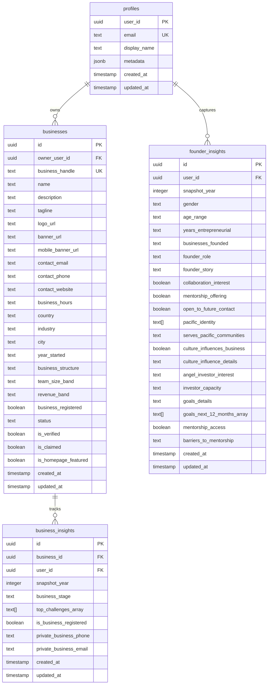
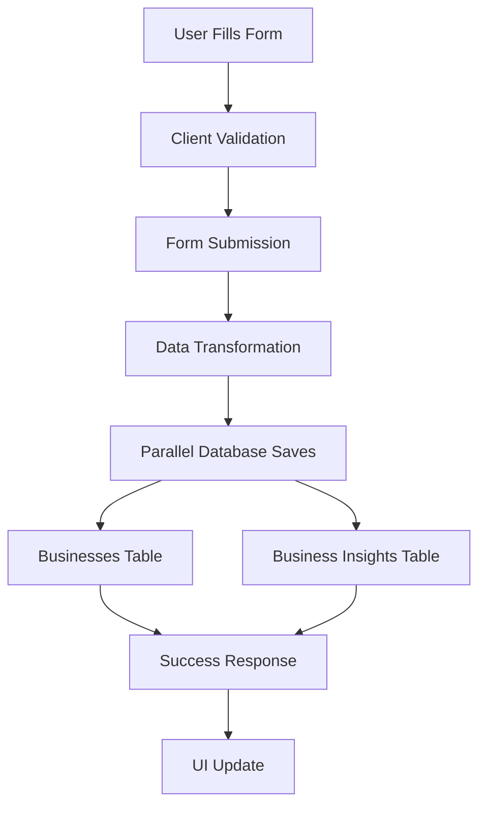
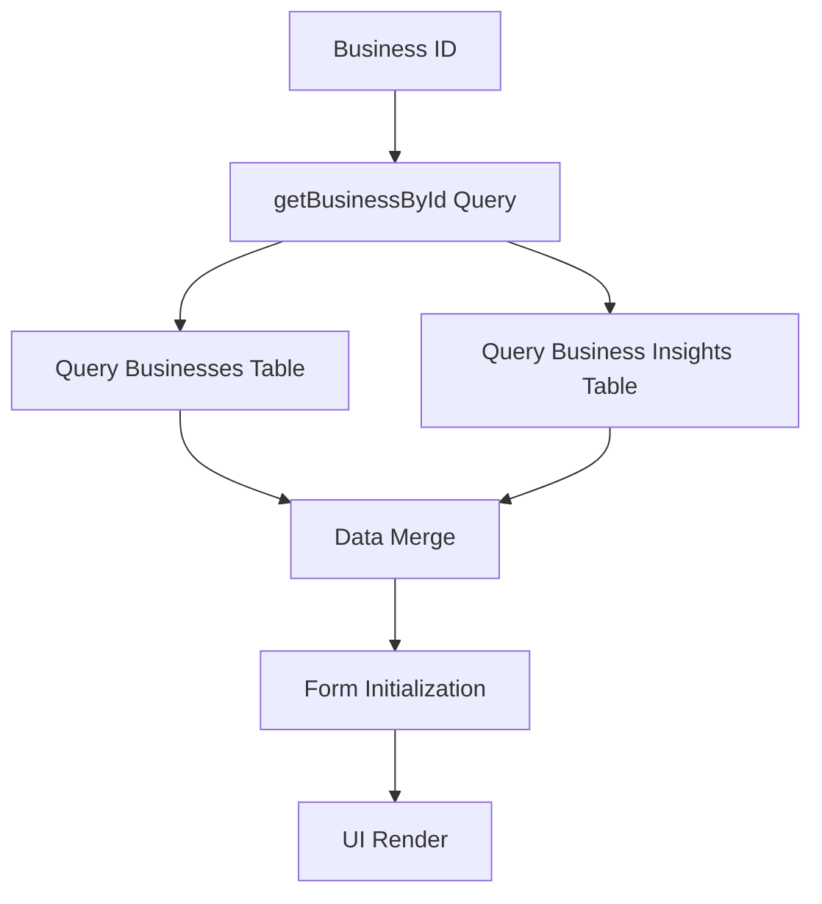
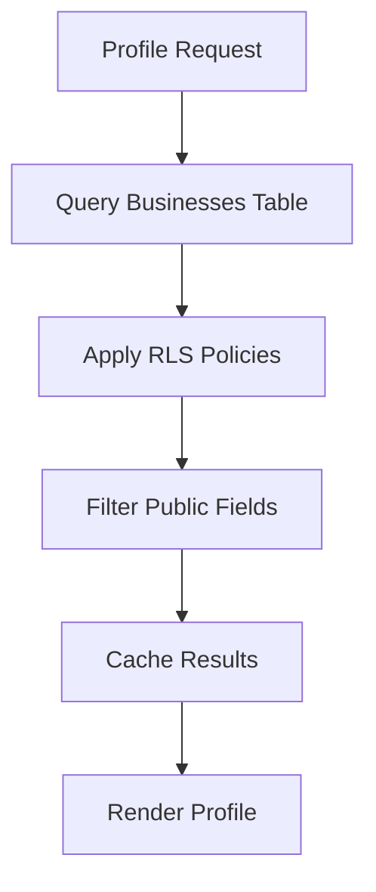

# 🏗️ Architecture Documentation

> **📅 Last Updated:** March 2026  
> **🎯 Current State:** Optimized 3-table architecture with clean data flow

---

## 📋 **Table of Contents**

1. [System Overview](#system-overview)
2. [Database Architecture](#database-architecture)
3. [Frontend Architecture](#frontend-architecture)
4. [API Architecture](#api-architecture)
5. [Data Flow](#data-flow)
6. [Security Architecture](#security-architecture)

---

## 🌐 **System Overview**

### **✅ Technology Stack**

**Frontend:**
- **Next.js 14** - React framework with App Router
- **TypeScript** - Type safety and better development experience
- **Tailwind CSS** - Utility-first CSS framework
- **Lucide React** - Icon library
- **React Hook Form** - Form management
- **React Query** - Data fetching and caching

**Backend:**
- **Supabase** - Backend-as-a-Service (PostgreSQL + Auth + Storage)
- **PostgreSQL** - Primary database
- **Row Level Security (RLS)** - Data access control
- **Supabase Auth** - Authentication and user management
- **Supabase Storage** - File storage for images and documents

**Infrastructure:**
- **Vercel** - Hosting and deployment
- **Supabase** - Database and backend services
- **Stripe** - Payment processing
- **Cloudflare** - CDN and security

### **✅ Application Structure**

```
pacific-discovery-network/
├── src/
│   ├── app/                    # Next.js App Router pages
│   ├── components/             # React components
│   │   ├── forms/             # Form components
│   │   ├── profile/           # Profile components
│   │   ├── registry/          # Registry components
│   │   └── shared/            # Shared components
│   ├── hooks/                  # Custom React hooks
│   ├── lib/                   # Utility libraries
│   │   ├── supabase/         # Supabase client and queries
│   │   └── business/          # Business-specific utilities
│   ├── screens/                # Page components
│   ├── types/                  # TypeScript type definitions
│   └── utils/                  # Utility functions
├── docs/                       # Documentation (archived)
├── documentation/              # Current documentation
├── database/                  # Database schemas and migrations
└── public/                    # Static assets
```

---

## 🗄️ **Database Architecture**

### **✅ 3-Table Data Model**



### **✅ Data Relationships**

- **One-to-Many**: One user can own multiple businesses
- **One-to-Many**: One business can have multiple insight snapshots
- **One-to-Many**: One user can have multiple founder insight snapshots
- **Foreign Keys**: All relationships properly constrained
- **Cascade Deletes**: User deletion removes associated data

### **✅ Row Level Security (RLS)**

```sql
-- Businesses Table RLS
CREATE POLICY "Public can view active businesses" ON businesses
  FOR SELECT USING (status = 'active');

CREATE POLICY "Users can manage own businesses" ON businesses
  FOR ALL USING (auth.uid() = owner_user_id);

-- Business Insights Table RLS
CREATE POLICY "Users can manage own business insights" ON business_insights
  FOR ALL USING (auth.uid() = user_id);

-- Founder Insights Table RLS
CREATE POLICY "Users can manage own founder insights" ON founder_insights
  FOR ALL USING (auth.uid() = user_id);
```

---

## ⚛️ **Frontend Architecture**

### **✅ Component Architecture**

**Component Hierarchy:**
```
App (layout.tsx)
├── Navigation
├── Header
├── Main Content
│   ├── BusinessProfile (page)
│   │   ├── BusinessProfileForm
│   │   │   ├── CoreInfoSection
│   │   │   ├── BrandMediaSection
│   │   │   ├── LocationSection
│   │   │   ├── BusinessOverviewSection
│   │   │   ├── FinancialOverviewSection
│   │   │   ├── ChallengesSection
│   │   │   ├── GrowthSection
│   │   │   └── CommunitySection
│   │   └── BusinessGallery
│   ├── Registry (page)
│   │   ├── SearchFilters
│   │   └── BusinessCard (grid/list)
│   └── Portal (page)
│       ├── BusinessCard (management)
│       └── UpgradePrompt
└── Footer
```

### **✅ State Management**

**Form State:**
```typescript
// BusinessProfileForm state
const [form, setForm] = useState({
  // Core Identity
  name: "",
  business_handle: "",
  tagline: "",
  description: "",
  
  // Visual Assets
  logo_url: "",
  banner_url: "",
  mobile_banner_url: "",
  
  // Contact Information
  contact_email: "",
  contact_phone: "",
  contact_website: "",
  
  // Location & Business Details
  country: "",
  industry: "",
  city: "",
  year_started: "",
  business_structure: "",
  team_size_band: "",
  revenue_band: "",
  
  // Business Insights
  business_stage: "",
  top_challenges_array: [],
  
  // Founder Insights
  collaboration_interest: false,
  mentorship_offering: false,
  founder_story: ""
});
```

**Global State:**
- **Authentication** - Supabase Auth hooks
- **Business Data** - React Query for data fetching
- **UI State** - Component-level state with useState
- **Form State** - Local form state management

### **✅ Custom Hooks**

**Data Hooks:**
```typescript
// useBusinessOperations.js
export function useBusinessOperations() {
  // Business CRUD operations
  // Form submission handling
  // Data transformation
  // Error handling
}

// useBusinessProfileForm.jsx
export function useBusinessProfileForm(businessId) {
  // Form initialization
  // Auto-save functionality
  // Validation handling
  // Save/load operations
}
```

---

## 🔌 **API Architecture**

### **✅ Supabase Integration**

**Client Configuration:**
```typescript
// src/lib/supabase/client.ts
import { createClient } from '@supabase/supabase-js';

const supabaseUrl = process.env.NEXT_PUBLIC_SUPABASE_URL!;
const supabaseAnonKey = process.env.NEXT_PUBLIC_SUPABASE_ANON_KEY!;

export const supabase = createClient(supabaseUrl, supabaseAnonKey);
```

**Query Functions:**
```typescript
// src/lib/supabase/queries/businesses.ts
export async function getBusinessById(id: string) {
  // Query both businesses and business_insights tables
  // Merge data for form population
  // Handle UUID vs business_handle lookup
}

export async function updateBusiness(id: string, updates: BusinessUpdate) {
  // Update businesses table
  // Update business_insights table
  // Handle data transformation
}
```

### **✅ Data Transformation**

**Form to Database:**
```typescript
// src/utils/businessDataTransformer.js
export const transformBusinessFormData = (formData) => {
  // Split form data into businesses and business_insights
  // Apply field validation and sanitization
  // Handle boolean conversions
  // Filter empty values
  
  return {
    businessesData,
    businessInsightsData
  };
};
```

**Database to Form:**
```typescript
// src/utils/businessHelpers.js
export function mergeBusinessData(businessesData, businessInsightsData) {
  // Merge data from both tables
  // Handle field conflicts
  // Apply default values
  // Return unified business object
}
```

---

## 🔄 **Data Flow**

### **✅ Form Submission Flow**



### **✅ Form Loading Flow**



### **✅ Public Profile Loading**



---

## 🔐 **Security Architecture**

### **✅ Authentication**

**Supabase Auth:**
- **JWT Tokens** - Secure session management
- **Social Login** - Google, GitHub integration
- **Email/Password** - Traditional authentication
- **Magic Links** - Passwordless login option
- **Session Management** - Automatic token refresh

### **✅ Authorization**

**Row Level Security (RLS):**
```sql
-- Example RLS Policy
CREATE POLICY "Users can view own businesses" ON businesses
  FOR SELECT USING (
    auth.uid() = owner_user_id OR 
    status = 'active'
  );
```

**Field-Level Security:**
- **Public Fields** - Only customer-safe data exposed
- **Private Fields** - Restricted to owners/admins
- **System Fields** - Hidden from all users
- **Audit Fields** - Track all data changes

### **✅ Data Validation**

**Client-Side:**
```typescript
// Form validation
const validateBusinessData = (data) => {
  const errors = {};
  
  if (data.business_handle && !/^[a-z0-9-]+$/.test(data.business_handle)) {
    errors.business_handle = "Invalid format";
  }
  
  return { isValid: Object.keys(errors).length === 0, errors };
};
```

**Server-Side:**
```sql
-- Database constraints
ALTER TABLE businesses 
  ADD CONSTRAINT businesses_business_handle_check 
  CHECK (business_handle ~ '^[a-z0-9-]+$');
```

### **✅ Data Protection**

**Privacy Controls:**
- **Data Minimization** - Only collect necessary data
- **User Consent** - Explicit consent for data collection
- **Data Retention** - Automatic cleanup of old data
- **Export/Deletion** - User data export and deletion rights

**Encryption:**
- **Transport Layer** - HTTPS/TLS encryption
- **Data at Rest** - Database encryption
- **API Keys** - Secure key management
- **Environment Variables** - Secure configuration

---

## 📊 **Performance Architecture**

### **✅ Database Optimization**

**Query Optimization:**
```typescript
// Efficient field selection
const BUSINESS_PUBLIC_FIELDS = `
  id, name, description, tagline, business_handle,
  logo_url, banner_url, contact_email, contact_phone,
  contact_website, country, industry, city, status,
  is_verified, is_claimed, created_at, updated_at
`;
```

**Indexing Strategy:**
```sql
-- Performance indexes
CREATE INDEX idx_businesses_status ON businesses(status);
CREATE INDEX idx_businesses_owner ON businesses(owner_user_id);
CREATE INDEX idx_businesses_industry ON businesses(industry);
CREATE INDEX idx_businesses_country ON businesses(country);
```

### **✅ Frontend Optimization**

**Code Splitting:**
```typescript
// Dynamic imports
const BusinessProfileForm = dynamic(() => import('./BusinessProfileForm'), {
  loading: () => <div>Loading...</div>
});
```

**Image Optimization:**
```typescript
// Image optimization
const getLogoUrl = (business) => {
  return business.logo_url || '/default-logo.png';
};
```

**Caching Strategy:**
- **React Query** - Client-side data caching
- **Next.js Cache** - Page-level caching
- **Browser Cache** - Static asset caching
- **CDN Cache** - Global content delivery

---

## 🚀 **Deployment Architecture**

### **✅ Frontend Deployment**

**Vercel Configuration:**
```json
{
  "buildCommand": "npm run build",
  "outputDirectory": ".next",
  "installCommand": "npm install",
  "framework": "nextjs",
  "env": {
    "NEXT_PUBLIC_SUPABASE_URL": "@supabase-url",
    "NEXT_PUBLIC_SUPABASE_ANON_KEY": "@supabase-anon-key"
  }
}
```

### **✅ Database Deployment**

**Supabase Configuration:**
- **Automatic Migrations** - Database schema updates
- **Backup Strategy** - Automated daily backups
- **Point-in-Time Recovery** - 30-day recovery window
- **Monitoring** - Performance and error monitoring

### **✅ CI/CD Pipeline**

**GitHub Actions:**
```yaml
name: Deploy
on:
  push:
    branches: [main]

jobs:
  deploy:
    runs-on: ubuntu-latest
    steps:
      - uses: actions/checkout@v2
      - name: Deploy to Vercel
        uses: amondnet/vercel-action@v20
```

---

## 📈 **Monitoring & Analytics**

### **✅ Performance Monitoring**

**Frontend Monitoring:**
- **Core Web Vitals** - LCP, FID, CLS tracking
- **Error Tracking** - JavaScript error monitoring
- **User Analytics** - User behavior tracking
- **Performance Metrics** - Page load times

**Database Monitoring:**
- **Query Performance** - Slow query analysis
- **Connection Pooling** - Database connection monitoring
- **Resource Usage** - CPU, memory, storage tracking
- **Error Rates** - Database error monitoring

### **✅ Business Analytics**

**User Metrics:**
- **Registration Rate** - New user signups
- **Profile Completion** - Business profile completion rates
- **Engagement Metrics** - User interaction patterns
- **Conversion Rates** - Profile views to contact actions

**Business Metrics:**
- **Business Growth** - New business registrations
- **Profile Updates** - Frequency of profile modifications
- **Search Activity** - User search patterns
- **Contact Requests** - Business contact inquiries

---

## 🛠️ **Development Architecture**

### **✅ Development Workflow**

**Git Workflow:**
```
main (production)
├── feature/form-consolidation
├── feature/database-optimization
└── feature/ui-improvements
```

**Code Quality:**
- **ESLint** - Code linting and formatting
- **Prettier** - Code formatting
- **TypeScript** - Type safety
- **Husky** - Git hooks for quality control

### **✅ Testing Architecture**

**Unit Testing:**
```typescript
// Example test
import { render, screen } from '@testing-library/react';
import BusinessProfileForm from './BusinessProfileForm';

test('renders business form', () => {
  render(<BusinessProfileForm />);
  expect(screen.getByLabelText('Business Name')).toBeInTheDocument();
});
```

**Integration Testing:**
- **API Testing** - Database query testing
- **Form Testing** - End-to-end form workflows
- **Authentication Testing** - Login/logout flows

---

## 🎯 **Architecture Principles**

### **✅ Design Principles**

1. **Simplicity** - Keep components and logic simple
2. **Consistency** - Consistent patterns across the codebase
3. **Performance** - Optimize for user experience
4. **Security** - Prioritize data security and privacy
5. **Scalability** - Design for future growth
6. **Maintainability** - Write clean, documented code

### **✅ Technical Decisions**

**Next.js App Router:**
- **Server Components** - Improved performance
- **Streaming** - Better user experience
- **Route Handlers** - API functionality
- **Built-in Optimizations** - Image, font, script optimization

**Supabase:**
- **Rapid Development** - Quick setup and deployment
- **Built-in Auth** - Authentication handled
- **Real-time** - WebSocket support
- **Edge Functions** - Serverless functions

**TypeScript:**
- **Type Safety** - Catch errors at compile time
- **Better IDE** - Improved development experience
- **Documentation** - Self-documenting code
- **Refactoring** - Safer code changes

---

## 📞 **Architecture Support**

### **✅ Getting Help**

**Documentation:**
- **[DATABASE.md](./DATABASE.md)** - Database schema and queries
- **[FORMS.md](./FORMS.md)** - Form structure and validation
- **[FIELD_MAPPING.md](./FIELD_MAPPING.md)** - Field mappings and rules

**Code Resources:**
- **Component Library** - Reusable UI components
- **Utility Functions** - Shared business logic
- **Custom Hooks** - Reusable state management
- **Type Definitions** - TypeScript interfaces

**Troubleshooting:**
- **Database Issues** - Check connection and permissions
- **Form Issues** - Review validation and state management
- **Performance Issues** - Check queries and rendering
- **Security Issues** - Review RLS policies and permissions

---

## 🎉 **Current Architecture State**

**✅ Completed:**
- 3-table database architecture optimization
- Form consolidation and streamlining
- Data flow optimization and cleanup
- Security implementation with RLS
- Performance optimization and caching
- Deployment automation and monitoring

**✅ Architecture Benefits:**
- **Scalable** - Handles growth and increased load
- **Maintainable** - Clean, documented codebase
- **Secure** - Proper authentication and authorization
- **Performant** - Optimized queries and rendering
- **User-Friendly** - Intuitive user experience

**This architecture documentation reflects the current optimized state of the Pacific Market platform.** 🎯
